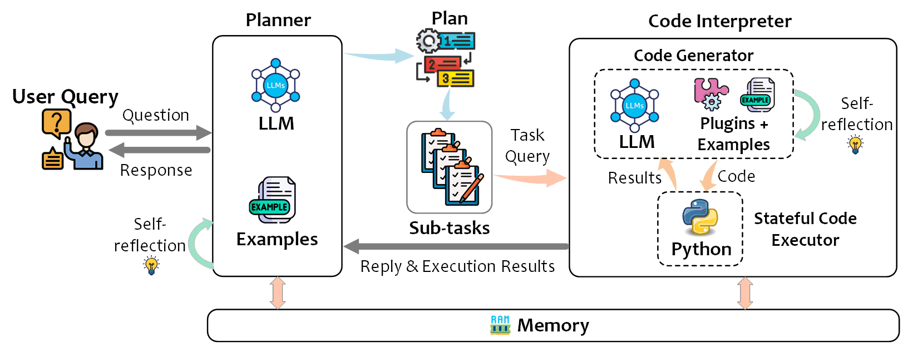

<h1 align="center">
     TaskWeaver
</h1>

<div align="center">

[](https://discord.gg/Z56MXmZgMb) &ensp;
&ensp;
[](https://opensource.org/licenses/MIT)&ensp;


</div>

TaskWeaver is A **code-first** agent framework for seamlessly planning and executing data analytics tasks. This innovative framework interprets user requests through coded snippets and efficiently coordinates a variety of plugins in the form of functions to execute data analytics tasks in a stateful manner.


<h1 align="center">
     
</h1>


## 🆕 News
- 📅2024-01-23: TaskWeaver can now be personalized by transforming your chat histories into enduring [experiences](https://microsoft.github.io/TaskWeaver/docs/experience) 🎉
- 📅2024-01-17: TaskWeaver now has a plugin [vision_web_explorer](https://github.com/microsoft/TaskWeaver/blob/main/project/plugins/README.md#vision_web_explorer) that can open a web browser and explore websites.🌐
- 📅2024-01-15: TaskWeaver now supports Streaming♒ in both UI and command line.✌️
- 📅2024-01-01: Welcome join TaskWeaver [Discord](https://discord.gg/Z56MXmZgMb).
- 📅2023-12-21: TaskWeaver now supports a number of LLMs, such as LiteLLM, Ollama, Gemini, and QWen🎈.
- 📅2023-12-21: TaskWeaver Website is now [available](https://microsoft.github.io/TaskWeaver/) with more documentations.
<!-- - 📅2023-12-12: A simple UI demo is available in playground/UI folder, try it [here](https://microsoft.github.io/TaskWeaver/docs/usage/webui)! -->
<!-- - [2023-11-30] TaskWeaver is released on GitHub🎈.  -->


## 💥 Highlights

- [x] **Rich data structure** - TaskWeaver allows you to work with rich data structures in Python, such as DataFrames, instead of dealing with strings.
- [x] **Customized algorithms** - TaskWeaver allows you to encapsulate your own algorithms into plugins and orchestrate them.
- [x] **Incorporating domain-specific knowledge** - TaskWeaver is designed to incorporat domain-specific knowledge easily to improve the reliability.
- [x] **Stateful execution** - TaskWeaver is designed to support stateful execution of the generated code to ensure consistent and smooth user experience.
- [x] **Code verification** - TaskWeaver is designed to verify the generated code before execution. It can detect potential issues in the generated code and provide suggestions to fix them.
- [x] **Easy to use** - TaskWeaver is easy to use with sample plugins, examples and tutorials to help you get started. TaskWeaver offers an open-box experience, allowing users to run it immediately after installation.
- [x] **Easy to debug** - TaskWeaver is easy to debug with detailed and transparent logs to help you understand the entire process, including LLM prompts, the code generation, and execution process.
- [x] **Security consideration** - TaskWeaver supports a basic session management to keep different users' data separate. The code execution is separated into different processes to avoid mutal interference.
- [x] **Easy extension** - TaskWeaver is easy to extend to accomplish more complex tasks with multiple agents as the plugins.

## ✨ Quick Start

### 🛠️ Step 1: Installation
TaskWeaver requires **Python >= 3.10**. It can be installed by running the following command:
```bash
# [optional to create conda environment]
# conda create -n taskweaver python=3.10
# conda activate taskweaver

# clone the repository
git clone https://github.com/microsoft/TaskWeaver.git
cd TaskWeaver
# install the requirements
pip install -r requirements.txt
```


### 🖊️ Step 2: Configure the LLMs
Before running TaskWeaver, you need to provide your LLM configurations. Taking OpenAI as an example, you can configure `taskweaver_config.json` file as follows. 

#### OpenAI
```json
{
"llm.api_key": "the api key",
"llm.model": "the model name, e.g., gpt-4"
}
```

💡 TaskWeaver also supports other LLMs and advanced configurations, please check the [documents](https://microsoft.github.io/TaskWeaver/docs/overview) for more details. 

### 🚩 Step 3: Start TaskWeaver

#### ⌨️ Command Line (CLI)
```bash
# assume you are in the cloned TaskWeaver folder
python -m taskweaver -p ./project/
```
This will start the TaskWeaver process and you can interact with it through the command line interface. 
If everything goes well, you will see the following prompt:

```
=========================================================
 _____         _     _       __
|_   _|_ _ ___| | _ | |     / /__  ____ __   _____  _____
  | |/ _` / __| |/ /| | /| / / _ \/ __ `/ | / / _ \/ ___/
  | | (_| \__ \   < | |/ |/ /  __/ /_/ /| |/ /  __/ /
  |_|\__,_|___/_|\_\|__/|__/\___/\__,_/ |___/\___/_/
=========================================================
TaskWeaver: I am TaskWeaver, an AI assistant. To get started, could you please enter your request?
Human: ___
```

####  or 💻 Web UI 
TaskWeaver also supports WebUI for demo purpose, please refers to [web UI docs](https://microsoft.github.io/TaskWeaver/docs/usage/webui) for more details.

#### or 📋 Import as a Library
TaskWeaver can be imported as a library to integrate with your existing project, more information can be found in [docs](https://microsoft.github.io/TaskWeaver/docs/usage/library)

## 📖 Documentation
More documentations can be found on [TaskWeaver Website](https://microsoft.github.io/TaskWeaver).


### ❓Get help 
* ❔GitHub Issues (prefered)
* [💬 Discord](https://discord.gg/Z56MXmZgMb) for discussion
* For other communications, please contact taskweaver@microsoft.com

---


## 🎬 Demo Examples

The demos were made based on the [web UI](https://microsoft.github.io/TaskWeaver/docs/usage/webui), which is better for displaying the generated artifacts such as images. 
The demos could also be conducted in the command line interface. 

#### 1️⃣📉 Example 1: Pull data from a database and apply an anomaly detection algorithm
In this example, we will show you how to use TaskWeaver to pull data from a database and apply an anomaly detection algorithm.

[Anomaly Detection](https://github.com/microsoft/TaskWeaver/assets/7489260/248b9a0c-d504-4708-8c2e-e004689ee8c6)

If you want to follow this example, you need to configure the `sql_pull_data` plugin in the `project/plugins/sql_pull_data.yaml` file.
You need to provide the following information:
```yaml
api_type: azure or openai
api_base: ...
api_key: ...
api_version: ...
deployment_name: ...
sqlite_db_path: sqlite:///../../../sample_data/anomaly_detection.db
```
The `sql_pull_data` plugin is a plugin that pulls data from a database. It takes a natural language request as input and returns a DataFrame as output.

This plugin is implemented based on [Langchain](https://www.langchain.com/).
If you want to follow this example, you need to install the Langchain package:
```bash
pip install langchain
pip install tabulate
```

#### 2️⃣🏦 Example 2: Forecast QQQ's price in the next 7 days
In this example, we will show you how to use TaskWeaver to forecast QQQ's price in the next 7 days. 

[Nasdaq 100 Index Price Forecasting](https://github.com/microsoft/TaskWeaver/assets/7489260/1361ed83-16c3-4056-98fc-e0496ecab015)

If you want to follow this example, you need to you have two requirements installed:
```bash
pip install yfinance
pip install statsmodels
```

For more examples, please refer to our [paper](http://export.arxiv.org/abs/2311.17541). 

> 💡 The planning of TaskWeaver are based on the LLM model. Therefore, if you want to repeat the examples, the execution process may be different
> from what you see in the videos. For example, in the second demo, the assistant may ask the user which prediction algorithm should be used.
> Typically, more concrete prompts will help the model to generate better plans and code.


## 📚 Citation
Our paper could be found [here](http://export.arxiv.org/abs/2311.17541). 
If you use TaskWeaver in your research, please cite our paper:
```
@article{taskweaver,
  title={TaskWeaver: A Code-First Agent Framework},
  author={Bo Qiao, Liqun Li, Xu Zhang, Shilin He, Yu Kang, Chaoyun Zhang, Fangkai Yang, Hang Dong, Jue Zhang, Lu Wang, Minghua Ma, Pu Zhao, Si Qin, Xiaoting Qin, Chao Du, Yong Xu, Qingwei Lin, Saravan Rajmohan, Dongmei Zhang},
  journal={arXiv preprint arXiv:2311.17541},
  year={2023}
}
```


## Trademarks

This project may contain trademarks or logos for projects, products, or services. Authorized use of Microsoft 
trademarks or logos is subject to and must follow 
[Microsoft's Trademark & Brand Guidelines](https://www.microsoft.com/en-us/legal/intellectualproperty/trademarks/usage/general).
Use of Microsoft trademarks or logos in modified versions of this project must not cause confusion or imply Microsoft sponsorship.
Any use of third-party trademarks or logos are subject to those third-party's policies.

## Disclaimer
The recommended models in this Repo are just examples, used to explore the potential of agent systems with the paper at [TaskWeaver: A Code-First Agent Framework](https://export.arxiv.org/abs/2311.17541). Users can replace the models in this Repo according to their needs. When using the recommended models in this Repo, you need to comply with the licenses of these models respectively. Microsoft shall not be held liable for any infringement of third-party rights resulting from your usage of this repo. Users agree to defend, indemnify and hold Microsoft harmless from and against all damages, costs, and attorneys' fees in connection with any claims arising from this Repo. If anyone believes that this Repo infringes on your rights, please notify the project owner email.