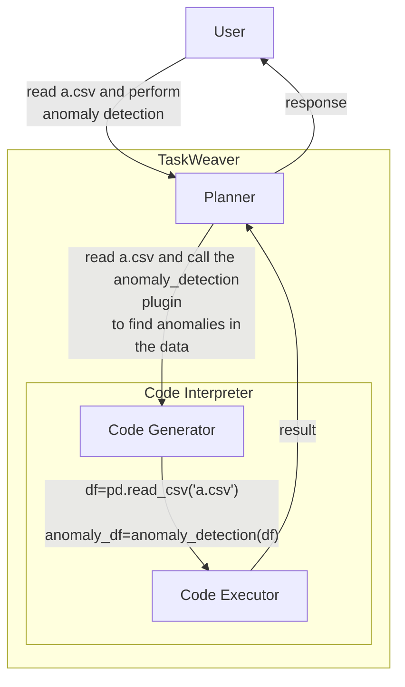
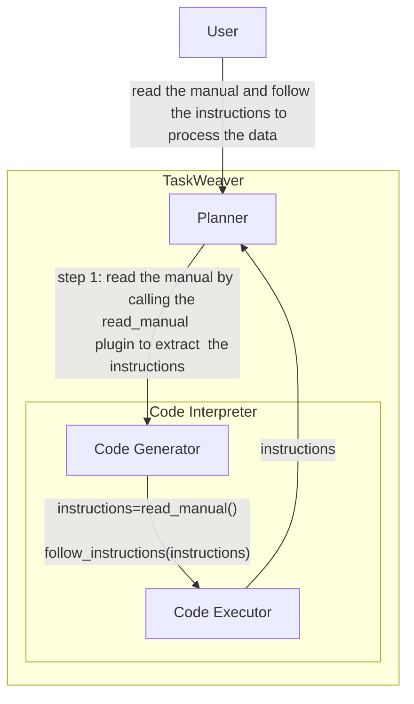
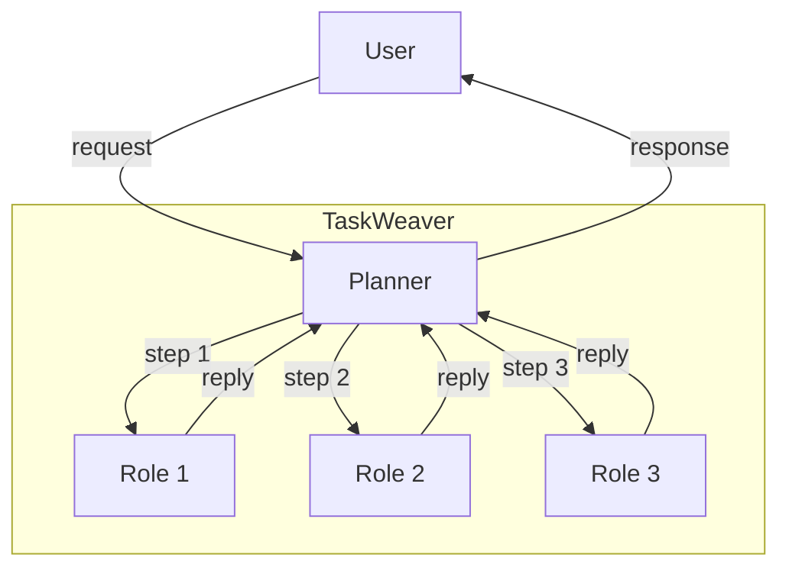

# Roles in TaskWeaver


We frame TaskWeaver as a **code-first** agent framework. The term "code-first" means that the agent is designed to
convert the user's request into one or multiple runnable code snippets and then execute them to generate the response.
The philosophy behind this design is to consider programming languages as the de facto language for communication in cyber-physical systems,
just like the natural language for human communication. Therefore, TaskWeaver translates the user's request in natural language into
programming languages, which can be executed by the system to perform the desired tasks.

Under this design, when the developer needs to extend the agent's capability, they can write a new plugin.
A plugin is a piece of code wrapped in a class that can be called as a function by the agent in the generated code snippets.
Let's consider an example: _the agent is asked to load a CSV file and perform anomaly detection on the data_.
The workflow of the agent is in the diagram below. It is very natural to represent data to be processed in variables and this task in code snippets.



<!-- truncate -->

However, we do find challenges for other tasks that are not naturally represented in code snippets.
Let's consider another example: _the agent is asked to read a manual and follow the instructions to process the data_.
We first assume there is a plugin that can read the manual and extract the instructions, called `read_manual`.
The workflow of the agent is in the diagram below. 
This diagram only shows the first step of the task, which is to read the manual and extract the instructions.
Although it does obtain the instructions, and the agent can follow them to complete the task, the behavior 
of the agent is less natural compared to the previous example.



Why? First, there is no need to generate code to read the manual and extract the instructions.
Once the Planner has decided to read the manual, the code to extract the instructions is straightforward.
Even though that there might be dynamic parts in the code such as some arguments in the function `read_manual`,
it could be handled by the Planner. Therefore, the Code Generator is not necessary in this case,
and the current flow actually incurred unnecessary LLM call overhead to generate the code snippets.
Second, it does not make sense to represent the instructions in variables.
The instructions are not data to be processed, but a text guide for the agent to follow.

For these reasons, we introduced the concept of [roles](/docs/concepts/role) in TaskWeaver.
Roles are actually not new in TaskWeaver as there are already roles like `Planner` and `CodeInterpreter`.
To add a new role, the developer can follow the documentation [here](/docs/concepts/role).
In general, a role is a class that inherits the `Role` class and implements the `reply` method.
The `reply` method is the function that the agent calls to interact with the role, which has the 
following signature:

```python
def reply(self, memory: Memory, **kwargs) -> Post:
    # implementation
```

It takes the `memory` object, which is the memory of the agent, and returns a [Post](/docs/concepts/post) object, which is the response of the role to the Planner.
With the `memory` object, the role can access the history of the conversation and the context of the conversation.
You may have noticed that all roles in TaskWeaver can only talk to the Planner, not to each other.
If a role needs to talk to another role, it should go through the Planner.
This design is to ensure that the Planner can control the conversation and the flow of the conversation.
For a task that requires multiple roles to work together, the Planner can orchestrate the roles to work together to complete the task 
as shown in the diagram below.


The communication between the Planner and the roles is done through the [Post](/docs/concepts/post) object.
In other words, they talk to each other by sending messages in natural language.
What if a role needs to send some data to another role? If this is the case, we would recommend to implement a new plugin
instead of a new role. Otherwise, you may need to store the data in an external storage like a database and let the other role to access it.

In summary, the concept of roles in TaskWeaver is to provide a way to extend the agent's capability by implementing new roles.
This is especially useful when the task is not naturally represented in code snippets such as acquire text information
from a knowledge base or the internet. Implementing a new role is straightforward by inheriting the `Role` class and implementing the `reply` method.
All extra roles should be put in the `TaskWeaver/taskweaver/ext_role` folder, which will be automatically loaded by TaskWeaver. 
We have provided a few sample roles in the `TaskWeaver/taskweaver/ext_role` folder, such as the `Echo` role that echoes the user's message back to the user.
More advanced role examples are the Planner and the CodeInterpreter roles, which are the core roles in TaskWeaver.


