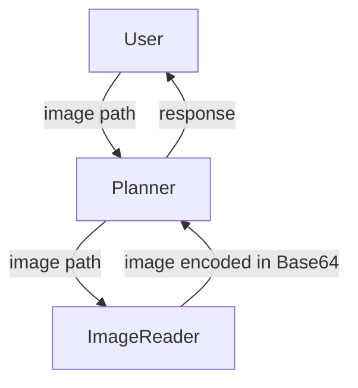

## Introduction

We have supported vision input for the Planner role in TaskWeaver. 
The Planner role is responsible for generating the high-level plan for the task. 
The vision input is a new type of input that contains images. 
This feature is useful when the task requires visual understanding.
<!-- truncate -->

## How vision input is supported in TaskWeaver

In TaskWeaver, we added a new role called `ImageReader` to read images and provide the image url (for remote images) or 
the image encoded in base64 (for local images) to the Planner role.
To have this new role, you need to include it in the project configure file as follows:

```json
{
    "session.roles": [
        "planner",
        "code_interpreter",
        "image_reader"
    ]
}
```

The ImageReader role takes the path or the url of the image as input and prepares a response Post for the Planner role. As described [here](https://learn.microsoft.com/en-us/azure/ai-services/openai/how-to/gpt-with-vision?tabs=rest) for Azure OpenAI API, if the image is local, ImageReader need to encode the image in base64 and pass it to the API. If the image is remote, ImageReader need to provide the url of the image. 
The Planner role can then use the image information for various tasks.

## An example

Let's ask the agent to describe any uploaded image.


The flow of the conversation is as follows:


In the example above, the User talks to the agent in Web UI and uploads an image. 
TaskWeaver also support providing the image path in console mode, either using the `/load` command or just include 
the image path in the input message.

## Extension

If you look into the implementation of the ImageReader role, you will find that it is quite simple.
The key logic is shown in the following code snippet:

```python
if image_url.startswith("http"):
    image_content = image_url
    attachment_message = f"Image from {image_url}."
else:
    if os.path.isabs(image_url):
        image_content = local_image_to_data_url(image_url)
    else:
        image_content = local_image_to_data_url(os.path.join(self.session_metadata.execution_cwd, image_url))
    attachment_message = f"Image from {image_url} encoded as a Base64 data URL."

post_proxy.update_attachment(
    message=attachment_message,
    type=AttachmentType.image_url,
    extra={"image_url": image_content},
    is_end=True,
)
```

After the image url is obtained, the ImageReader role will encode the image in base64 if the image is local. 
Then, it will create an attachment in the response Post and pass the image content to the Planner role.
To achieve this, the attachment is created with the type `AttachmentType.image_url` and the image content is
passed as extra data with the key `image_url`.

Therefore, if we want to support other scenarios with vision input, we can extend the ImageReader role by adding more logic 
to handle different types of contents. One example is to support reading a document with text and images.
We can add an attachment for each image in the document and pass the list of attachments to the Planner role.


