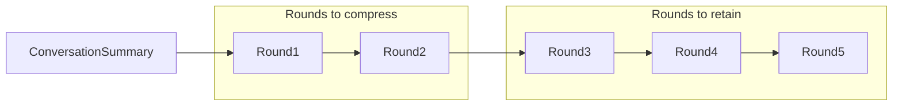

# Prompt Compression

After chatting for a few rounds, the chat history can become quite long, especially when we have code and execution results in it.
This can cause the problem of exceeding the context window of the LLMs. 
To solve the problem, one way is to summarize the chat history a few rounds ago, 
and only keep the latest rounds of the chat history.

Another way is to use a vector database to store the chat history entries, and only retrieve the last few rounds of the relevant
part given the current user request. However, in TaskWeaver, code is also part of the chat history.
It is not an option to skip some intermediate code and execution results in order to correctly
generate the code for the current user request. Therefore, we choose the first way to solve the problem.

The following figure shows the idea of chat history summarization where the chat history is divided into two parts:
- Rounds to compress: this part is summarized and only the summary is kept in the chat history. If the context_summary 
    already exists, a new summary is generated based on the previous summary adding the rounds to be summarized.
- Rounds to retain: this part is kept in the chat history without summarization.


Imagine that, at the beginning, the ConversationSummary is empty.
Once the chat history reaches the `rounds_to_compress` (default 2) rounds plus `rounds_to_retain` (default 3) rounds,
the ConversationSummary is generated based on the `rounds_to_compress` rounds and the `rounds_to_retain` rounds are kept in the chat history.
After that, there will be only `rounds_to_retain` rounds in the chat history.
The next time the chat history reaches the `rounds_to_compress` rounds plus `rounds_to_retain` rounds,
the ConversationSummary is generated based on the `rounds_to_compress` rounds and the previous ConversationSummary.
We use these two parameters to control the frequency of the chat history summarization.

An example of the chat history summarization in the Code Generator is shown below:

```json
{
  "ConversationSummary": "The user requested the generation of 100 random numbers, which was successfully executed. Then, the user asked to show the top 5 largest numbers from the generated random numbers. The assistant provided a code snippet to sort the generated random numbers in descending order and select the top 5 largest numbers, which was also successfully executed. After that, the user requested to plot the distribution of the 100 numbers, which was successfully executed. The user then asked to count the frequency of numbers in each bin of the histogram and identify the bin with the most numbers for the 0.1 bin width, which was also successfully executed.",
  "Variables": [
    {
      "name": "random_numbers_100",
      "type": "numpy array",
      "description": "An array containing 100 random numbers generated using np.random.rand()"
    },
    {
      "name": "top_5_largest",
      "type": "numpy array",
      "description": "An array containing the top 5 largest numbers from the generated random numbers"
    }
  ]
}
```
The JSON object has two fields:
- ConversationSummary: the summary of the chat history.
- Variables: the variables in the chat history that could be used in the current user request.

The chat history summary of the Planner has only the ConversationSummary field. 

The actual code generated in the summarized rounds is ignored and only the variables are kept in the summary
so that the LLM can still refer the these variables in future code generation.

One thing to note is that chat history summarization requires call the LLM which incurs additional latency and cost.
The prompts for chat history summarization could be found for [planner](../taskweaver/planner/compression_prompt.yaml)
and [code generator](../taskweaver/code_interpreter/code_generator/compression_prompt.yaml).

## Configurations
As explained above, there are two parameters in controlling the chat history summarization: 
`round_compressor.rounds_to_compress` (default 2) and `round_compressor.rounds_to_retain` (default 3).
To enable the chat history summarization, you need to set `planner.prompt_compression` 
and `code_generator.prompt_compression` to `true`.


