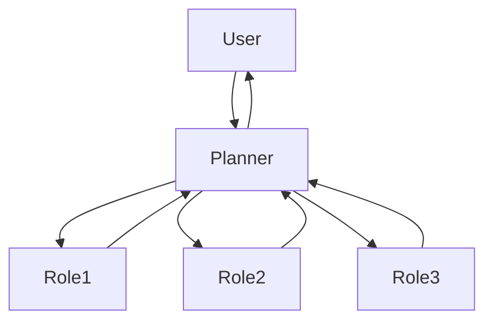
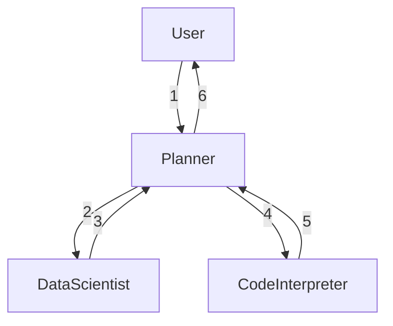
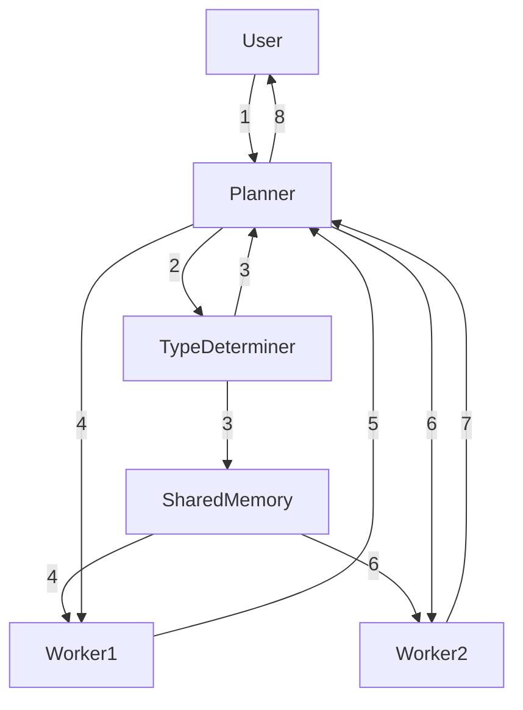

# Memory

The primary purpose of the `memory` module is to store the information that is required to maintain the context of the conversation.
You can find the implementation code in `taskweaver/memory/memory.py`.
We have introduced various concepts such as `Round` and `Post` in the [concepts](concepts/) section,
which are the building blocks of the Memory module.

There are two kinds of information that are stored in the memory:

1. **Conversation History**: This includes the conversation that has happened so far between the user and various roles in TaskWeaver.
2. **Shared Memory**: This includes the information that is purposefully shared between the roles in TaskWeaver.

Let's briefly discuss the two types of information.

## Role-wise Conversation History

A TaskWeaver agent is composed of one or more roles. Each [role](concepts/role.md) have its own conversation history.
In TaskWeaver, we orchestrate the roles in a star topology, where the Planner is at the center and the roles are at the periphery.
The User only interacts with the Planner, and the Planner interacts with the roles, making planning and instructing other roles to carry out the tasks,
as shown in the figure below.



Though this fixed orchestration is a limitation, it reserves the independence of the roles. Each role does not need to know about the other roles, even their existence. For any peripheral role, the Planner is the only point of contact, i.e., its real "User",
and it only focuses on its own expertise. It is the Planner's responsibility to leverage multiple roles
for complex tasks and orchestrate them to achieve the goal.

The conversation history of each role is stored in the memory. When a role needs to prepare a response, it can refer to the conversation history
to understand the context of the conversation. Specifically, this typically is the process of preparing a prompt for the LLM, containing all
the previous chat rounds and the current request. A role only cares about the Posts sent or received by itself.

## Shared Memory

While we want to maintain the independence of the roles, there are cases where the roles need to share information. 
One common case is about information sharing between two peripheral roles. For example, the Planner may ask the Code Interpreter to generate code 
based on the guide provided by a Data Scientist role. In this case, the Planner needs to share the guide with the Code Interpreter.
In theory, this can be done by the Planner repeating the guide to the Code Interpreter, shown in the figure below.


However, we found that the Planner can fail to repeat the guide accurately, leading to miscommunication. 

Another use case is a role needing to store some control state that is shared among all roles. For example, the agent needs to handle multiple types
of tasks. The "type" of the current user request is only determined by one role (e.g., namely `TypeDeterminer`), but all other roles need to know the type to prepare the response.
In this case, the role that determines the type can store the type in the shared memory, and other roles can refer to the shared memory to get the type.



:::tip
The number in the arrows indicates the order of the information flow.
:::

For the aforementioned reasons, we introduced the concept of Shared Memory. The Shared Memory is a special [Attachment](concepts/attachment.md) that is appended to the 
post of the role who wants to share information. 
The attachment has a instance of SharedMemoryEntry in the `extra` field. The SharedMemoryEntry has the following fields:

```python
class SharedMemoryEntry:
    type: Literal[...] # The type of the shared memory entry
    content: str # The content of the shared information
    scope: Literal["round", "conversation"] # The scope of the shared information
    id: str # The id of the shared memory entry
```

Understanding the `scope` field is crucial to understand the Shared Memory. The `scope` field determines the scope of the shared information.
If the `scope` is `round`, the shared information is only effective for the current round. 
Otherwise, if the `scope` is `conversation`, the shared information is effective for the whole conversation.

One question may be why we do not store the shared information in a separate data structure, instead of the Attachment in Posts.
The reason is that, if a Round fails, we need to remove the shared information within that Round as well. 
By storing the shared information in the Attachment, as a part of the Post, we can easily filter out the shared information based on the Round status. 
This is similar with designing the logging system of database operations in a transaction.

The consumer of the shared information can use `type` to retrieve the shared memory entries that is effective for the current chat round,
including the conversational ones. However, if one role has multiple shared memory entries with the same `type`, 
only the latest one is effective. In other words, later shared memory entries overwrite the previous ones with the same `type` from the same role.

A reference implementation of the Shared Memory is provided in the `taskweaver/planner/planner.py`, 
where the Planner role shares the details of the plan with other roles.
