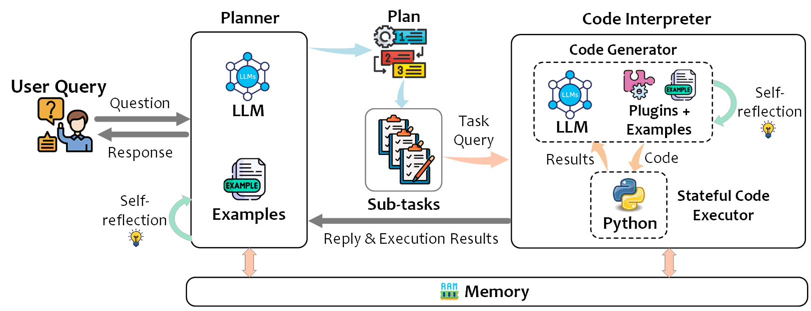

# Overview
<!-- 

<h1 style={{display: flex, padding: 0 20px}}>

TaskWeaver
</h1> -->
<!-- 
 -->

**TaskWeaver** is a *code-first* agent framework for seamlessly planning and executing data analytics tasks. 
This innovative framework interprets user requests through coded snippets and efficiently 
coordinates a variety of plugins in the form of functions to execute 
data analytics or workflow automation tasks.

**Highlighted Features**

- [x] **Rich data structure** - TaskWeaver allows you to work with rich data 
    structures in Python, such as Lists, Dictionaries, or Pandas DataFrames, instead of having to restrict to 
    text strings.
- [x] **Customized algorithms** - TaskWeaver allows you to encapsulate your 
    own algorithms or functions into plugins (in the form of Python functions), 
    and orchestrate them to achieve complex tasks.
- [x] **Incorporating domain-specific knowledge** - TaskWeaver is designed to 
    be easily incorporating domain-specific knowledge, such as the knowledge or experience in task planning and code generation, to improve the reliability of task execution.
- [x] **Stateful conversation** - TaskWeaver is designed to support stateful 
    conversation which means you can interact with your data in memory across multiple chat rounds.
- [x] **Code verification** - TaskWeaver is designed to verify the generated code 
    before execution. It can detect potential issues in the generated code 
    and automatically fix them.
- [x] **Security consideration** - TaskWeaver supports running code inside a sandbox 
    environment to prevent malicious code execution. It also provides a basic session management to keep
    different users' data separate.
- [x] **Easy to debug** - TaskWeaver is designed to be easy to debug. 
    We have detailed logs, metrics, and traces, instrumenting using OpenTelemetry, to help you understand what is going on under the simple chat interface.
- [x] **Easy to extend** - TaskWeaver is designed to be easily extended to accomplish more complex tasks. 
    Beyond the plugins, you can create extra roles, define how they interact with the Planner and orchestrate them to achieve more complex tasks.
- [x] **Easy to use** - TaskWeaver is designed to be easy to use. 
    We provide a set of sample plugins and a tutorial to help you get started.
    We also provide a all-in-one Docker image to help you quickly play with TaskWeaver.