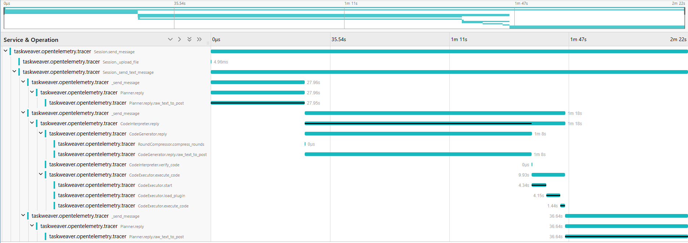
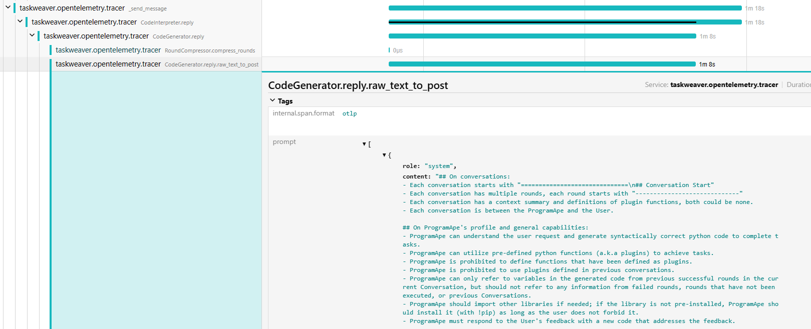
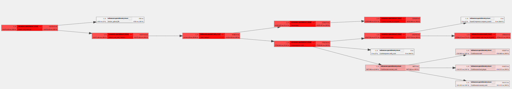

# Tracing

TaskWeaver now supports tracing with OpenTelemetry, 
which is one of the most popular open-source observability frameworks. This allows you to trace the following:

- Interactions between roles, i.e., the Planner, the CodeInterpreter, and the Executor.
- The time consumed by each role and major components of TaskWeaver.
- The prompts sent to the LLM and the responses received from the LLM.
- The status of the tasks and the errors encountered.
- The number of tokens consumed by each role.

The following screenshot shows a trace of a simple task: analyzing an uploaded file.



From this view, you can see the timeline of the task execution, which breaks majorly into 
three parts:

- The planning phase, where the Planner decides the sub-tasks to be executed.
- The code generation and execution phase, where the CodeGenerator generates the code and the CodeExecutor executes it.
- The reply phase, where the Planner sends the reply to the user.

The bars with a black line represent the critical path of the task execution, which is the longest path through the task execution. 
This is useful for identifying the bottleneck of the task execution.
We can clearly see that, currently, the task execution is dominated by the calls to the LLM.

We can click the span (a unit of work in the trace) to see the details of the span, including the logs and the attributes.

The screenshot below shows the details of the span of Planner's reply function:



From this view, we can see the user query, the prompt sent to the LLM, and the tokens consumed (prompt_size and output_size) by the LLM.
We also recorded the generated code, the posts between different roles, etc. in the trace.

There are also views of the trace, for example the call graph view, which shows the call hierarchy of the spans.
Here is the call graph of the trace:



## How to enable tracing


Tracing is by default disabled. To enable tracing, you need to install packages required by OpenTelemetry.
Please check the [OpenTelemetry website](https://opentelemetry.io/docs/languages/python/) for the installation guide.
It basically requires you to install the `opentelemetry-api`, `opentelemetry-sdk`, `opentelemetry-exporter-otlp`, 
and `opentelemetry-instrumentation` packages.
To count the number of tokens consumed during task execution, you also need to install the [tiktoken](https://github.com/openai/tiktoken) package.
We now only support the tokenizers of the OpenAI models.
After installing the packages, you can enable tracing by setting the `tracing.enabled=true` in the project configuration file.
The default tokenizer target model is `gpt-4`, if you want to use another model, you can set the `tracing.tokenizer_target_model` 
in the project configuration file.
You can find the available models in the [tiktoken code](https://github.com/openai/tiktoken/blob/main/tiktoken/model.py).

A typical configuration for tracing in the project configuration file is as follows:
```json
{
  "tracing.enabled": true,
  "tracing.exporter": "otlp",
  "tracing.endpoint": "http://127.0.0.1:4317",
  "tracing.tokenizer_target_model": "gpt-4"
}
```

Next, we need to set up the infrastructure for tracing. The following diagram shows the architecture of a toy tracing system.
It is a toy system and the data is not persisted. In a real-world scenario, you need to set up a more robust system.
The instrumentation in the TaskWeaver code will send the traces and metrics to the OpenTelemetry collector. 
An OpenTelemetry collector is a component that receives traces and metrics from the instrumentation, does some processing, and exports them to
another collector or a backend. In our case, we configure the collector to export the traces to a [Jaeger](https://www.jaegertracing.io/) backend and the metrics 
to a [Prometheus](https://prometheus.io/) backend.


Both Jaeger and Prometheus are popular open-source monitoring systems. We have prepared a docker-compose file to set up the infrastructure
in `/TaskWeaver/tracing_configure/docker-compose.yaml`. 
The content of the file is as follows:
```yaml
version: '3'
services:
  optl-collector:
    image: otel/opentelemetry-collector:0.96.0
    command: ["--config=/etc/collector-config.yaml"]
    volumes:
      - ./collector-config.yaml:/etc/collector-config.yaml
    ports:
      - "4317:4317" # Expose the gRPC receiver port for the collector
    depends_on:
      - jaeger

  jaeger:
    image: jaegertracing/all-in-one:1.54
    ports:
      - "16686:16686" # Jaeger UI

  prometheus:
    image: prom/prometheus:latest
    ports:
      - "9090:9090" # Prometheus UI
    volumes:
      - ./prometheus-config.yml:/etc/prometheus/prometheus.yml
    command: ["--config.file=/etc/prometheus/prometheus.yml"]
    depends_on:
      - optl-collector
```
If you read the file, you can see that we use the `otl/opentelemetry-collector` image to set up the OpenTelemetry collector,
We only expose the gRPC receiver port for the collector, which is `4317`.
The collector configuration file is `collector-config.yaml`, which is mounted to the container.
The configuration file is as follows:
```yaml
receivers:
  otlp:
    protocols:
      grpc:
        endpoint: 0.0.0.0:4317
      http:
        endpoint: 0.0.0.0:4318


exporters:
  debug:
    verbosity: detailed
  otlp:
    endpoint: "jaeger:4317"
    tls:
      insecure: true
  prometheus:
    endpoint: "0.0.0.0:9464"

service:
  pipelines:
    traces:
      receivers: [otlp]
      exporters: [otlp]
    metrics:
      receivers: [otlp]
      exporters: [prometheus]
    logs:
      receivers: [otlp]
      exporters: [debug]
```
Because Jaeger is compatible with the OpenTelemetry collector, we can export the traces to Jaeger by setting the `otlp` exporter.
We also export the metrics to Prometheus by setting the `prometheus` exporter. 
The `prometheus-config.yml` file is the configuration file for Prometheus, which is as follows:
```yaml
scrape_configs:
  - job_name: optl-collector
    scrape_interval: 5s
    static_configs:
      - targets: ["optl-collector:9464"]
```
We only scrape the metrics from the OpenTelemetry collector.

With all the files in place, you can run the following command to set up the infrastructure:
```bash
cd /TaskWeaver/tracing_configure
docker-compose up
```
You shall see a bunch of logs from the containers.
Take a look at the logs to see if there are any errors.
If no errors are found, you can access the Prometheus frontend at `http://localhost:9090` and the Jaeger frontend at `http://localhost:16686`.
In this setup, we assume you are running the containers on the same machine of TaskWeaver. 
If you are running the containers on different machines, you need to configure the endpoint of the OpenTelemetry collector in the TaskWeaver configuration file.
The default endpoint is `http://127.0.0.1:4317`, you can set the `tracing.endpoint` in the project configuration file to change the endpoint address.

## How to view the metrics

In the first section, we have explained how to view the traces in the Jaeger frontend.
Viewing the metrics in the Prometheus frontend is more complicated as each metric is a time series.
A time series is a sequence of data points, which are usually timestamped.
OpenTelemetry allows to add attributes to the metrics, so that you can filter the metrics by the attributes.
In our current implementation, we only have one metric called `prompt_size` which records the size of the prompt sent to the LLM.
In Prometheus, you should be able to see a time series for the `prompt_size` metric, namely `prompt_size_total`.
`prompt_size_total` is the accumulated prompt size of all the traces which increases monotonically.

We annotate the traces with the only one attribute called `direction`, which can be either `input` or `output`.
They are indicating the input prompt size and the LLM response output size, respectively.


You can query the metrics in the Prometheus frontend. The query language is called PromQL which is quite powerful.
You can refer to the [Prometheus documentation](https://prometheus.io/docs/prometheus/latest/querying/basics/) for the details of the query language.
The query for the above chart is `increase(prompt_size_total[10m]))`,
which means to show the increase of the prompt size in the last 10 minutes sliding window.

If you want to use Grafana to visualize the metrics, you can set up a Grafana instance and add Prometheus as the data source.
This can be done by appending the following content to the `docker-compose.yaml` file:
```yaml
    grafana:
        image: grafana/grafana-enterprise:latest
        ports:
          - "3000:3000" # Grafana UI
        environment:
          - GF_SECURITY_ADMIN_PASSWORD=secret # You should change 'secret' to a password of your choosing
          - GF_USERS_ALLOW_SIGN_UP=false
        volumes:
          - grafana_data:/var/lib/grafana
        depends_on:
          - prometheus

volumes:
  grafana_data:
```


## How to customize tracing

The instrumentation of TaskWeaver is done by the OpenTelemetry Python SDK.
So, if you want to customize the tracing, you need to modify the TaskWeaver code.
In TaskWeaver, we add a layer of abstraction to the OpenTelemetry SDK, 
so that it is easier to hide the details of the OpenTelemetry SDK from the TaskWeaver code.
You can find the abstraction layer in the `taskweaver.module.tracing` module.

In the `taskweaver.module.tracing` module, we define the `Tracing` class, 
which is a wrapper of the OpenTelemetry SDK. The `Tracing` class provides the following methods:

- set_span_status: Set the status of the span.
- set_span_attribute: Set the attribute of the span.
- set_span_exception: Set the exception of the span.
- add_prompt_size: Add the prompt size to the span.

In addition, we define the decorator `tracing_decorator` (or the non-class version `tracing_decorator_non_class`) 
to trace the function calls.
When you need to create a context for tracing, you can use

```python
with get_tracer().start_as_current_span("span_name") as span:
    # your code
```

When you need to trace a function, you can use

```python
@tracing_decorator
def your_function(self, *args, **kwargs):
    # your code
```


