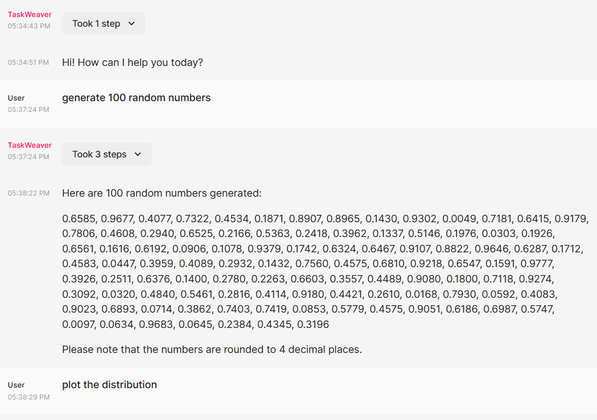
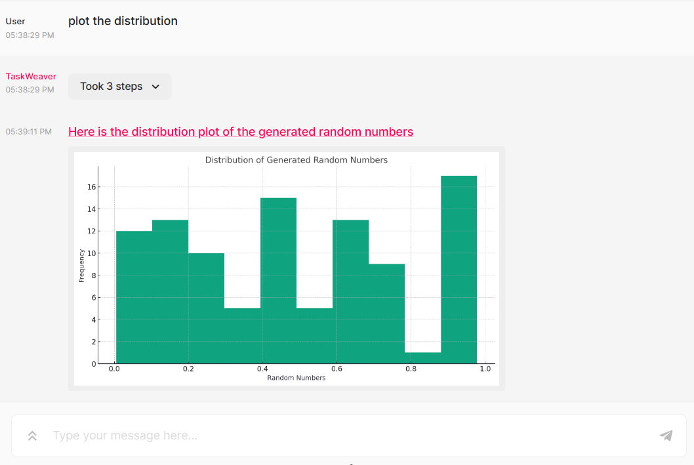

# Web UI

1. Follow the instruction in [Quick Start](../quickstart.md) to clone the repo and make configurations

```bash
git clone https://github.com/microsoft/TaskWeaver.git
cd TaskWeaver
# install the requirements
pip install -r requirements.txt
```

```json
{
"llm.api_key": "the api key",
"llm.model": "the model name, e.g., gpt-4"
}
```

2. Install the `chainlit` package by `pip install chainlit` if you don't have it in your env.

3. Start the service by running the following command.

```bash
cd playground/UI/
chainlit run app.py
```

4. Open the browser with http://localhost:8000 and you can start the trial. 

5. Below are some screenshots:

